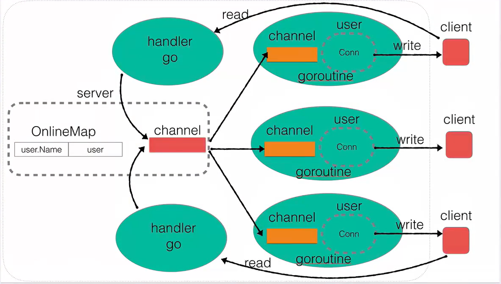

### Server-整体结构

### Feature
* 用户上线广播
* 用户消息广播
* 私聊
* 在线用户查询
* 修改当前用户名
* 超时强踢
* 简易的Client

### Reference
[Aceld: 8小时转职Golang工程师](https://www.bilibili.com/video/BV1gf4y1r79E)

### Note:
* Read方法返回EOF错误
  
  表示**本端感知到对端已经正常关闭(调用Close)conn连接**（本端已接收到对端发送的FIN）。此后如果本端不调用Close方法，则连接处于非完全关闭状态（CLOSE_WAIT）。即文件描述符发生泄漏。
* Read方法返回0
  
  1. 情况一：**本端已关闭连接对端的conn**(A)，此时本端若Read刚才关闭的conn(A)，则返回0，*error：use of closed network connection*
  2. 情况二：**对端主机强制关闭conn(如CTRL+C)**,此时本端Read该conn时返回0，*error：An existing connection was forcibly closed by the remote host*